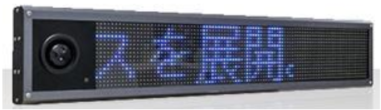

# Experience

## ADE Technology Inc
2017 Aug ~ Present
* 經濟部工業局智慧城鄉計畫
    * 架構:與能專計畫大致相同，但規模較大
    * 預訂場域:阿瘦皮鞋
* 經濟部能源局業界能專計畫

在IP cam中加入people count功能(最近新增節能控制器)，並透過mqtt將資料傳到rest server進行統計分析，該平台同時有管理設備的功能。

    * 前端：基於react-redux-starter-kit
    * 後端：基於express 與 mongoDB實現restful api，並使用docker搭建環境，搭配aws S3 實現即時影像顯示(偵數很低)

* LED (產品)
    * 前端：改成同樣基於 react 的 ant-design-pro
    * 後端；由大陸同事負責，透過websocket傳送資料，並使用js解碼影像(html5影像串流解決方案)

在LED字幕機中嵌ip cam 及熱像儀，可使用網頁管理字幕機內容及設定警報溫度，並觀看即時熱像及影像專案前期：使用Axure規劃網站初步內容給上司業務看(參考資料)，經過同意才實作

## LOHAS IT
2016 Aug ~ 2017 Jul

使用現成的 wordpress CMS 架設購物網站，並架設在廉價主機商中(LNMP環境)，並開始使用phpstorm 去trace code，解決wordpress的插件衝突問題，並協助客戶規劃購物車網站，內容包含商品動線、金流串接、物流串階及整理。並實作(除美術部分)。
* lavido.com.tw 

* www.healthimei.com 義美生機

## PIXNET
2016 May ~ 2016 Jul

掌握linux console、vim、git(無gui)的使用，初階php撰寫。

## RETCHAT
2015 Mar ~ 2016 Feb

使用selenium webdriver測試廣告推薦網頁
