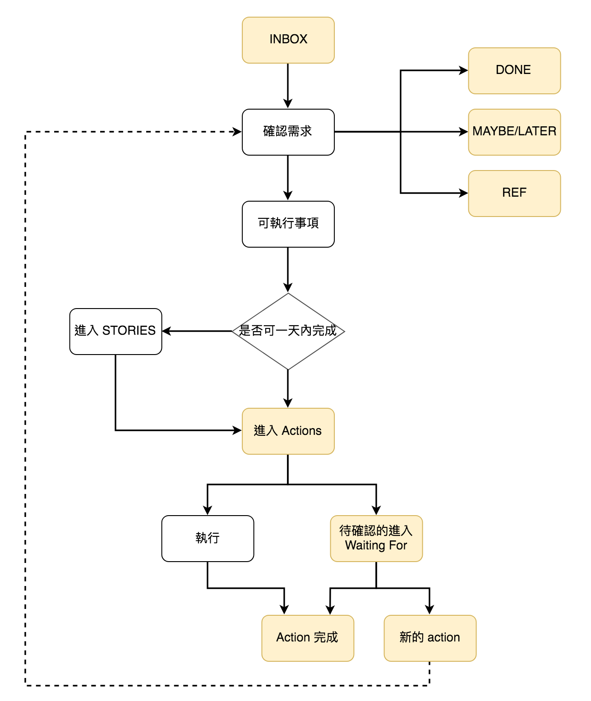

工作流程
===========================

>   INBOX(收件夾)：
 >>* Check email
 >>* Issues Assigned to Me(redmine)
 
 > DONE
>>* Pending(redmine)
>>* closed(redmine)

> REF
>>* 文件製作
>>* 工單資訊補全(redmine)

>MAYBE/LATER
>>* not marked in progress(redmine)  

>ACTION
>>* marked in progress(redmine) 
 ----------

 -  **確認需求**：
 放到 INBOX 的事項不會自己完成，通常等手上事情忙完或是固定一段時間來整理。整理的方式是把收件夾的東西做分類放到以下四個類別的其中一種：完成、也許/之後、參考資料(REF)、可執行事項。
        
    確認需求時如果一個事項不需要做任何事情就可以直接認定完成，或是兩分鐘內可以完成的，也就順手處理掉。好像沒有那麼急又需要/想要做的，就放到也許/之後。參考資料類就丟到參考資料夾（wiki、文件）。剩下的就是想要儘速執行的事項了，這些通稱為『可執行事項』
    
-   **可執行事項**：為了要能夠達到『專注』同時又能夠彈性的應變現實突發狀況，很重要的一點是，事項盡量越小越明確越好，比如說一小時半小時可以處理完的。因此可執行事項需要分成兩類：可一次完成的 以及不能的。
    
    所謂可以一次完成的意思是，如果前置條件都具備的情況之下，只要花點時間就可以完成的事情。比如說換冷氣濾網只要我手上有新的濾網就可以一次完成，但如果我沒有新的濾網我就需要去買濾網，這整件事情就需要分步驟來完成。而需要分步驟完成的，通稱為『故事(Stories)』。故事一樣有自己的一區。
    
    可以一次完成的事項裡面有些事需要其他人幫忙的或是特定日期才會發生的，就放到 Waiting For，等這事項完畢之後再來接續執行後續事項。
    
-   **行動清單(Actions)**：經過前面層層過濾之後，能進到 Action List 的都是可以直接執行的事項。能做到這步就可以隨時隨地無腦的開始處理清單裡的事項了。
    
-   **故事(Stories)**：沒辦法一次完成的事情，開始執行之前通常需要把故事拆為小小的可以一次完成的行動。在redmine裡可視為**切單**。
****
改寫自
http://finfin.github.io/2018/07/28/GTD-everything.html
